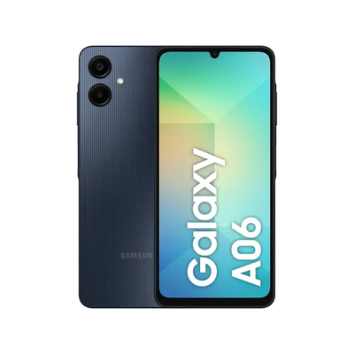
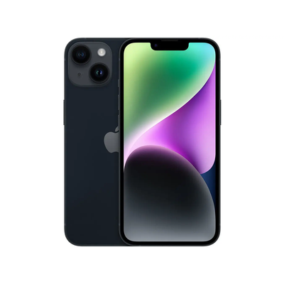
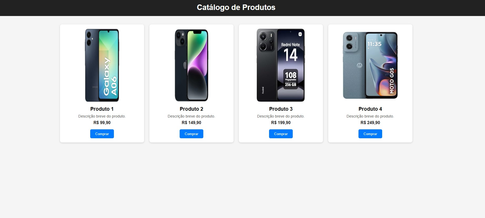
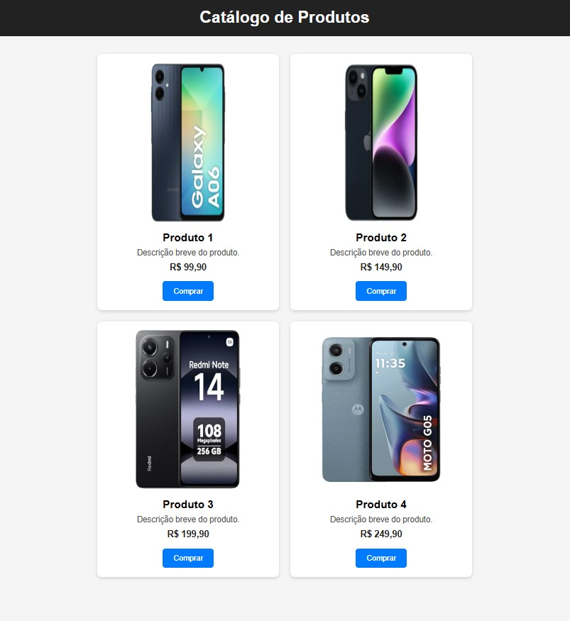

### **🎯 Exercício - 1 Prático Avançado: Catálogo de Produtos com Flexbox**  

**Objetivo:** Criar um **catálogo de produtos responsivo** usando **Flexbox**. O layout deve ser organizado, com espaçamento adequado e uma aparência profissional.  

---

### **📌 O que vamos fazer?**  

✔️ Criar um **catálogo de produtos** organizado em "cards".  
✔️ Os produtos devem se alinhar **automaticamente** na tela, sem precisar de `media queries`.  
✔️ Os cards terão uma **imagem, título, descrição e botão de compra**.  
✔️ **Flexbox** será utilizado para alinhar os elementos e distribuir os produtos dinamicamente.  
✔️ **./assets/images/** estarão as imagens ja no formato e tamanho do prototipo.  

---

### **1️⃣ Estrutura do HTML**  

Crie um arquivo `index.html` e adicione:  

```html
<!DOCTYPE html>
<html lang="pt-BR">
<head>
    <meta charset="UTF-8">
    <meta name="viewport" content="width=device-width, initial-scale=1.0">
    <title>Catálogo de Produtos</title>
    <link rel="stylesheet" href="./css/style.css">
</head>
<body>
    <header>
        <h1>Catálogo de Produtos</h1>
    </header>
    <main class="container">
        <div class="card">
            
            <h2>Produto 1</h2>
            <p>Descrição breve do produto.</p>
            <span>R$ 99,90</span>
            <button>Comprar</button>
        </div>
        <div class="card">
            
            <h2>Produto 2</h2>
            <p>Descrição breve do produto.</p>
            <span>R$ 149,90</span>
            <button>Comprar</button>
        </div>
        <div class="card">
            
            <h2>Produto 3</h2>
            <p>Descrição breve do produto.</p>
            <span>R$ 199,90</span>
            <button>Comprar</button>
        </div>
        <div class="card">
            
            <h2>Produto 4</h2>
            <p>Descrição breve do produto.</p>
            <span>R$ 249,90</span>
            <button>Comprar</button>
        </div>
    </main>
</body>
</html>
```

---

### **2️⃣ Estilização com Flexbox**  

Crie um arquivo `styles.css` para estilizar os produtos com **Flexbox**:  
Sintam-se à vontade para personalizar cores, imagens e bordas conforme desejarem, desde que sigam fielmente o layout do protótipo abaixo. 😁
---
### **3️⃣ Prototipo da estilização**  



---

### **📌 O que você aprendeu?**  

✅ `display: flex;` para alinhar os produtos lado a lado.  
✅ `flex-wrap: wrap;` para ajustar os produtos automaticamente na tela.  
✅ `gap: 20px;` para espaçar os elementos de forma uniforme.  
✅ `justify-content: center;` para centralizar os itens na página.  

💡 **Agora é sua vez!** Personalize cores, fontes e adicione mais produtos! 🚀

---

# 🎯 Exercício - 2 Flexbox: Festival de Personagens

## 📝 Objetivo

Nesta atividade você irá treinar o **display: flex** criando um layout visualmente organizado e responsivo, colocando seus **personagens favoritos** em destaque. Seu desafio é aplicar tudo que aprendemos sobre **flex-direction, justify-content, align-items, flex-wrap** e **gap** para deixar o conteúdo bonito, legível e divertido!

---

## 🎯 Requisitos da Atividade

1. **Estrutura da Página**

   * Crie uma página HTML com o título: `Festival de Personagens`.
   * Organize os personagens em **cards**, cada um com:

     * **Imagem do personagem** (PNG ou JPG)
     * **Nome do personagem**
     * **Breve descrição** (uma frase divertida ou curiosidade)
   * Todos os cards devem estar dentro de um container flexível.

2. **Estilização**

   * O container principal deve usar **display: flex**.
   * Explore diferentes **direções (row/column)** e **alinhamentos (justify-content, align-items)**.
   * Os cards devem ter **tamanhos iguais**, margem e espaçamento entre eles.
   * Inclua **hover effects** para deixar a interação mais divertida (opcional, mas recomendado).

3. **Responsividade**

   * Quando a tela for menor, os cards devem se reorganizar automaticamente.
   * Utilize **flex-wrap** para quebrar linha e manter a estética do layout.

4. **Criatividade**

   * Escolha seus personagens favoritos de **filmes, games, séries ou animes**.
   * Capriche na escolha das cores, bordas e estilos para tornar seu festival único! 🌈✨

---

## 📂 Entrega

* Coloque todos os arquivos em uma pasta com seu nome.
* A estrutura mínima:

```
/FestivalPersonagens
    ├── index.html
    ├── style.css
    └── imagens/
```

* Faça commit e push para o seu repositório no GitHub.

---

## ✅ Dicas Extras

* Experimente **justify-content: space-between / space-around / center** para ver diferentes alinhamentos.
* Combine **flex-direction row e column** dentro de containers diferentes para treinar.
* Se quiser, adicione **uma pequena animação** no hover para os cards.

---


